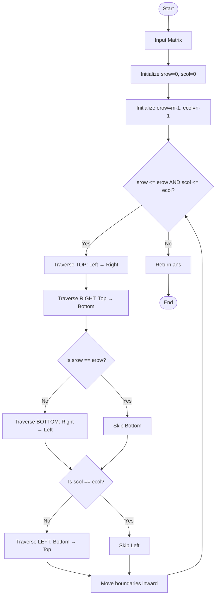

# 🌀 Spiral Matrix Traversal

A C++ implementation of the **Spiral Matrix** problem.
The program traverses a 2D matrix in **clockwise spiral order** using four boundaries: `srow`, `erow`, `scol`, and `ecol`.

## 📌 Problem

Given an `m × n` matrix, return all elements of the matrix in **spiral order**.

### Example

**Input:**

```text
1  2  3
4  5  6
7  8  9
```

**Output:**

```text
1 2 3 6 9 8 7 4 5
```

---

## 🔄 Algorithm

The matrix is traversed layer by layer using four boundaries:

* `srow` → Starting row
* `erow` → Ending row
* `scol` → Starting column
* `ecol` → Ending column

For every layer, we perform four steps:

1. **Top** → Move from left to right
2. **Right** → Move from top to bottom
3. **Bottom** → Move from right to left
4. **Left** → Move from bottom to top

After completing one layer, all four boundaries are moved inward.

---

## 📊 Workflow / Flowchart



---

## 💻 C++ Code

```cpp
#include <iostream>
#include <vector>
using namespace std;

class Solution {
public:
    vector<int> spiralOrder(vector<vector<int>>& mat) {

        int m = mat.size();
        int n = mat[0].size();

        int srow = 0, scol = 0;
        int erow = m - 1, ecol = n - 1;

        vector<int> ans;

        while (srow <= erow && scol <= ecol) {

            // Top
            for (int j = scol; j <= ecol; j++) {
                ans.push_back(mat[srow][j]);
            }

            // Right
            for (int i = srow + 1; i <= erow; i++) {
                ans.push_back(mat[i][ecol]);
            }

            // Bottom
            for (int j = ecol - 1; j >= scol; j--) {
                if (srow == erow) {
                    break;
                }

                ans.push_back(mat[erow][j]);
            }

            // Left
            for (int i = erow - 1; i >= srow + 1; i--) {
                if (scol == ecol) {
                    break;
                }

                ans.push_back(mat[i][scol]);
            }

            // Move boundaries inward
            srow++;
            erow--;
            scol++;
            ecol--;
        }

        return ans;
    }
};
```

---

## 🧠 Example Walkthrough

For:

```text
1  2  3
4  5  6
7  8  9
```

The traversal is:

```text
→ → →
      ↓
↓     ↓
← ← ←
↑
↑
```

Result:

```text
1 → 2 → 3
          ↓
4         6
↑         ↓
7 ← 8 ← 9
```

Final answer:

```text
1 2 3 6 9 8 7 4 5
```

---

## ⏱️ Complexity

### Time Complexity

```text
O(m × n)
```

Every element of the matrix is visited exactly once.

### Space Complexity

```text
O(m × n)
```

The output vector stores all matrix elements.

---

## 🛠️ Technologies Used

* **C++**
* **2D Vector**
* **Arrays / Matrices**
* **Boundary Traversal**
* **Simulation**

---

## 📚 Concepts Learned

* Matrix traversal
* Nested loops
* Boundary management
* Vector operations
* Edge-case handling
* Algorithm complexity

---

## 👨‍💻 Author

**Partha Pratim Mallick**

⭐ If you found this implementation useful, consider giving the repository a star!
